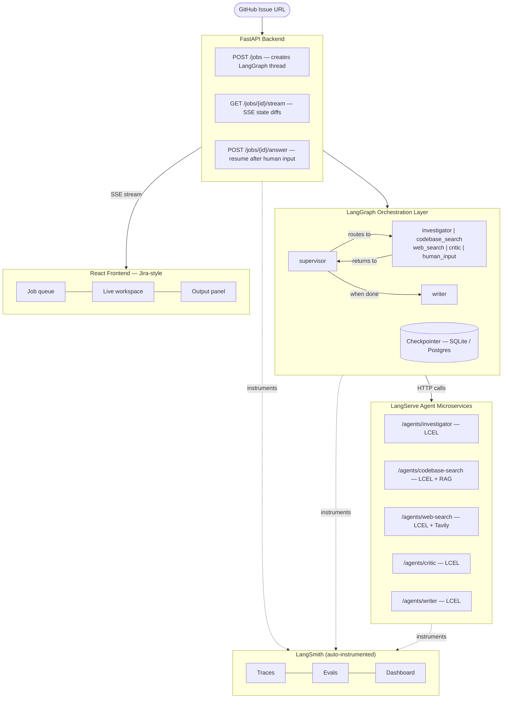

# PRD-001 — AgentOps Dashboard

| Field        | Value                              |
|--------------|------------------------------------|
| Document ID  | PRD-001                            |
| Version      | 1.0                                |
| Status       | DRAFT                              |
| Date         | March 2026                         |
| Author       | Product & Engineering Team         |
| Related Docs | [PRD-002](PRD-002-frontend-ux.md), [PRD-003](PRD-003-langgraph-orchestration.md), [PRD-004](PRD-004-agent-layer.md), [PRD-005](PRD-005-langsmith-observability.md), [PRD-006](PRD-006-data-validation.md), [PRD-007](PRD-007-developer-tooling.md), [PRD-008](PRD-008-authentication.md), [PRD-009](PRD-009-documentation-standards.md) |

---

## Executive Summary

AgentOps Dashboard is a developer-facing platform for orchestrating, supervising, and debugging multi-agent AI workflows
for software development tasks. The product combines the full LangChain ecosystem — **LangChain, LCEL, LangGraph,
LangSmith, LangServe, and LangFlow** — into a coherent, production-grade system fronted by a **Jira-inspired user
interface**.

The core insight driving this product is that multi-agent AI systems today suffer from a critical UX gap: models are
capable enough to do real work, but there is no intuitive interface for a developer to supervise, steer, and trust a
coordinated team of AI agents. AgentOps Dashboard fills this gap.

> **Elevator Pitch:** AgentOps Dashboard is Jira for AI agents. Submit a GitHub issue, and watch a team of specialized
> AI agents investigate, reason, debate, and produce a full triage report — while you retain full control to pause,
> redirect, or override any agent at any moment. Agents can also stop and ask *you* questions when they need more context,
> just like a junior developer would.

---

## Problem Statement

### The Multi-Agent Visibility Gap

Modern LLM agents are capable of autonomous reasoning, tool use, and multi-step planning. However, when multiple agents
collaborate on a complex task, developers currently face:

- No real-time visibility into what each agent is doing and why
- No ability to intervene mid-task when an agent heads in the wrong direction
- No standardized way to evaluate whether agent outputs are correct or improving over time
- No clean separation between agent logic (what agents do) and orchestration logic (how they coordinate)
- No human-friendly interface — everything lives in terminal logs or raw LangSmith traces

### The Software Dev Triage Pain Point

Bug triage is a high-value, time-consuming workflow with clear AI ROI. A typical senior engineer spends 30–45 minutes
per complex issue: reading the issue, searching the codebase, checking similar past bugs, forming a hypothesis, and
writing up findings. This is exactly the kind of structured, multi-step, tool-heavy workflow that multi-agent systems
excel at — but only if a human can trust and steer the process.

---

## Goals and Non-Goals

### Goals

1. Deliver a working multi-agent **bug triage system** for GitHub repositories using the full LangChain ecosystem
2. Provide a **Jira-inspired real-time dashboard** where each job is a "ticket" that agents fill in live via streaming
3. Implement **bidirectional human-in-the-loop**: agents can ask the user clarifying questions mid-execution, blocking
   the graph until the user responds
4. Allow the user to **pause, redirect, or kill** any agent at any point during execution
5. Instrument the full system with **LangSmith** for tracing, evaluation, and cost monitoring
6. Use **LangFlow** as the visual prototyping and agent configuration layer before chains graduate to LangServe
7. Deploy each agent chain as an independent **LangServe** microservice endpoint
8. Serve as a strong portfolio project demonstrating production-grade LangX ecosystem usage

### Non-Goals (v1.0)

- Support for non-GitHub trackers (Jira, Linear, GitLab) — v2 roadmap
- Fully autonomous operation with zero human oversight
- Support for non-software-dev domains — v2 roadmap
- Real-time multi-user collaborative sessions
- Mobile interface
- Self-hosted LLM support (Ollama etc.) — v2 roadmap

---

## User Personas

| Persona    | Role                    | Primary Goal                                                 | Key Pain Point                                                            |
|------------|-------------------------|--------------------------------------------------------------|---------------------------------------------------------------------------|
| **Alex**   | Senior Backend Engineer | Triage incoming GitHub bugs faster without losing context    | Spends 30+ min per issue reading the codebase before forming a hypothesis |
| **Jordan** | Engineering Manager     | Monitor AI agent quality and cost across team repos          | Black-box AI feels untrustworthy — no visibility into agent reasoning     |
| **Sam**    | ML/AI Engineer          | Iterate on agent prompts and chains quickly                  | Edit code → redeploy → re-test cycle is too slow for prompt iteration     |
| **Taylor** | Tech Lead               | Configure agent behavior per repo without touching internals | Every AI tool requires bespoke integration work                           |

---

## Product Overview

### What It Is

AgentOps Dashboard is a web application with a Python/FastAPI backend and a React frontend. Users connect a GitHub
repository, submit an issue URL, and the system:

1. Spins up a **LangGraph supervisor agent** that decomposes the triage task
2. Spawns specialized **worker agents** (Investigator, Codebase Searcher, Web Searcher, Critic, Writer) — each backed by
   a **LangServe** endpoint containing an **LCEL** chain
3. Streams real-time state updates to the frontend via **Server-Sent Events**
4. Pauses whenever an agent needs human input, surfacing a question card in the UI
5. Produces a final structured output: severity rating, root cause, relevant files, a drafted GitHub comment, and a
   ticket draft — all editable before posting

### The Jira Analogy

The product is intentionally modeled after Jira's mental model:

| Jira Concept         | AgentOps Equivalent                                       |
|----------------------|-----------------------------------------------------------|
| Project              | GitHub Repository                                         |
| Issue / Ticket       | Triage Job (submitted GitHub issue)                       |
| Assignee             | Active Agent                                              |
| Status column        | Agent execution state (Queued / Running / Waiting / Done) |
| Comments thread      | Agent reasoning + question/answer exchanges               |
| Labels               | Severity, root cause category, affected modules           |
| Workflow transitions | LangGraph node transitions                                |
| Activity log         | LangSmith trace (linked from each job)                    |

---

## LangChain Ecosystem Map

Every tool in the LangX ecosystem plays a specific, non-forced role in this product.

| Tool                 | Layer                   | Exact Role                                                                                                                                                                                                                           |
|----------------------|-------------------------|--------------------------------------------------------------------------------------------------------------------------------------------------------------------------------------------------------------------------------------|
| **LangChain + LCEL** | Micro (agent internals) | Each worker agent is an LCEL chain: `prompt \| llm \| output_parser`. Handles streaming, async, parallel execution, and structured output parsing.                                                                                   |
| **LangFlow**         | Prototyping             | Visual canvas used to design and test each agent's LCEL chain before it's committed to code. Also serves as the agent configuration UI for non-technical users.                                                                      |
| **LangServe**        | Deployment              | Each finalized agent chain is deployed as an independent HTTP endpoint (`POST /agents/investigator/invoke`). The LangGraph supervisor calls these endpoints as tools — clean microservice separation.                                |
| **LangGraph**        | Macro (orchestration)   | Supervisor pattern: manages which agent runs next, handles shared state flowing through all nodes, implements `interrupt()` for human-in-the-loop pauses, and persists state via checkpointing.                                      |
| **LangSmith**        | Observability           | Instruments all layers automatically. Traces LCEL chain internals, LangGraph node transitions, and cross-agent job traces. Provides eval datasets, A/B prompt testing, and a "View in LangSmith" deep-link from every job in the UI. |

---

## High-Level Architecture

---

## Feature Summary

| Feature                                          | Priority | PRD Reference |
|--------------------------------------------------|----------|---------------|
| Job queue with Jira-style ticket cards           | P0       | [PRD-002](PRD-002-frontend-ux.md)                   |
| Real-time streaming agent output in workspace    | P0       | [PRD-002](PRD-002-frontend-ux.md)                   |
| Agent question cards (human-in-the-loop)         | P0       | [PRD-003](PRD-003-langgraph-orchestration.md)        |
| Pause / redirect / kill agent mid-execution      | P0       | [PRD-003](PRD-003-langgraph-orchestration.md)        |
| Supervisor + 5 worker agents (LangGraph)         | P0       | [PRD-003](PRD-003-langgraph-orchestration.md)        |
| LCEL agent chains deployed via LangServe         | P0       | [PRD-004](PRD-004-agent-layer.md)                   |
| LangFlow canvas for agent prototyping            | P1       | [PRD-004](PRD-004-agent-layer.md)                   |
| LangSmith trace deep-link per job                | P0       | [PRD-005](PRD-005-langsmith-observability.md)        |
| Eval dataset + quality scoring                   | P1       | [PRD-005](PRD-005-langsmith-observability.md)        |
| GitHub write-back (comment + label)              | P1       | [PRD-002](PRD-002-frontend-ux.md)                   |
| Codebase vector index (semantic search)          | P1       | [PRD-004](PRD-004-agent-layer.md)                   |
| Agent configuration UI (model, prompt, endpoint) | P2       | [PRD-004](PRD-004-agent-layer.md)                   |
| Cost and latency analytics dashboard             | P2       | [PRD-005](PRD-005-langsmith-observability.md)        |
| Input validation (issue_url, Pydantic v2)        | P0       | [PRD-006](PRD-006-data-validation.md)                |
| Python tooling (uv / ruff / ty / pyproject.toml) | P0       | [PRD-007](PRD-007-developer-tooling.md)              |
| Authentication & authorization (GitHub OAuth, JWT) | P0     | [PRD-008](PRD-008-authentication.md)                 |

---

## Success Metrics

| Metric                                  | Target (v1.0)                                         |
|-----------------------------------------|-------------------------------------------------------|
| End-to-end triage time (agent)          | < 3 minutes per issue                                 |
| Human triage agreement rate             | ≥ 70% match with human-written triage on eval dataset |
| LangSmith eval score (helpfulness)      | ≥ 4.0 / 5.0                                           |
| Agent question relevance (human rating) | ≥ 80% of agent-asked questions rated "useful"         |
| Time-to-first streaming output in UI    | < 5 seconds from job submission                       |
| System uptime                           | ≥ 99% during active sessions                          |

---

## Release Roadmap

| Phase                           | Scope                                                                         | Target      |
|---------------------------------|-------------------------------------------------------------------------------|-------------|
| **Phase 1** — Core Loop         | Single investigator agent, LangGraph basics, LCEL chains, LangSmith tracing   | Weeks 1–3   |
| **Phase 2** — Multi-Agent       | Supervisor + all 5 worker agents, LangServe endpoints, shared state           | Weeks 4–5   |
| **Phase 3** — Human-in-the-Loop | `interrupt()` nodes, pause/kill/redirect, checkpointing                       | Week 6      |
| **Phase 4** — Backend API       | FastAPI + SSE streaming, job persistence, answer endpoint                     | Weeks 7–8   |
| **Phase 5** — React UI          | Jira-style dashboard, live workspace, question cards, output panel            | Weeks 9–11  |
| **Phase 6** — Polish            | GitHub write-back, LangSmith evals, codebase vector index, LangFlow config UI | Weeks 12–13 |

---

## Risks and Mitigations

| Risk                                                      | Likelihood | Impact | Mitigation                                                                                          |
|-----------------------------------------------------------|------------|--------|-----------------------------------------------------------------------------------------------------|
| Supervisor agent makes poor routing decisions             | Medium     | High   | LangSmith evals + prompt iteration via LangFlow before production                                   |
| Agent asks irrelevant or too many questions               | Medium     | Medium | Calibrate supervisor's question threshold in system prompt; rate-limit to 2 questions per job in v1 |
| Codebase search returns irrelevant results on large repos | High       | Medium | Use semantic vector search (Chroma + embeddings) rather than keyword search                         |
| LangGraph state explosion on long jobs                    | Low        | High   | Set max node execution limits; add job timeout at 10 minutes                                        |
| LangServe endpoint latency degrades overall job time      | Medium     | Medium | Add per-agent timeout of 60s; supervisor retries once before escalating to human                    |
| Cost overruns from GPT-4 calls                            | Medium     | Medium | Default to GPT-4o-mini; allow model override per agent in config                                    |

---

## Assumptions, Constraints, Dependencies

### Assumptions

- Users have a GitHub account and are comfortable with GitHub issues/PRs
- The target repository is accessible via the GitHub REST API (public or authenticated private)
- Users have an OpenAI or Anthropic API key
- LangSmith account is available (free tier is sufficient for v1)

### Constraints

- v1.0 supports only Python-based repositories for codebase analysis
- Maximum job execution time: 10 minutes
- Maximum codebase size for vector indexing: 500MB
- Human-in-the-loop question limit per job: 2 questions (to prevent over-reliance on user)

### External Dependencies

- GitHub REST API — for reading issues, PRs, and writing comments
- OpenAI / Anthropic API — LLM inference
- Tavily API — web search tool for the Web Search agent
- LangSmith API — observability and evaluation
- LangChain, LangGraph, LangServe, LangFlow — open-source packages (MIT licensed)
- **Redis** — job queue (ARQ), Pub/Sub event bus for SSE fanout, and job status storage
- **ARQ** — async Redis queue for distributed LangGraph job execution across worker processes; provides `Job.abort()` for cross-process kill, built-in status tracking, and automatic requeue on worker crash
