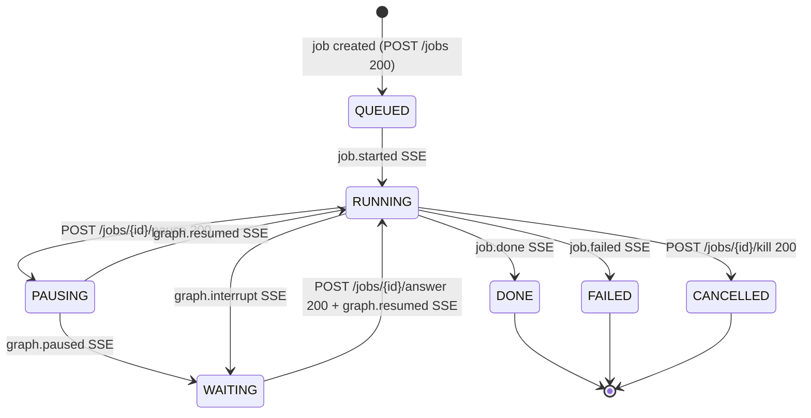
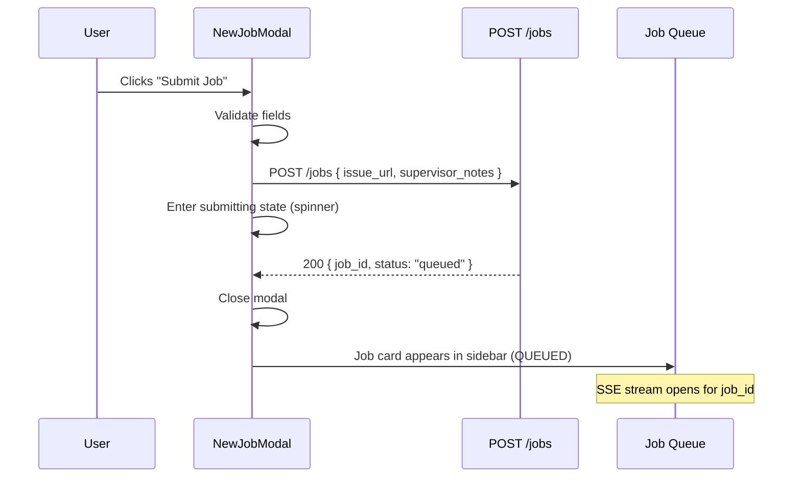
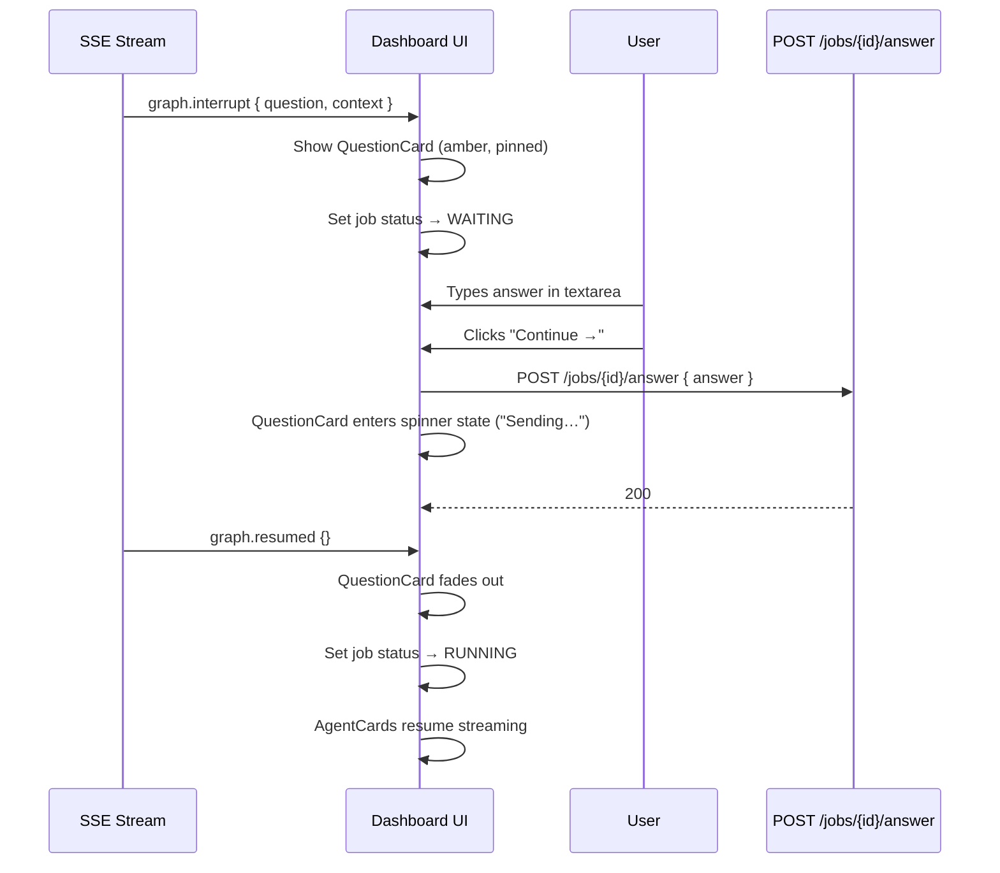
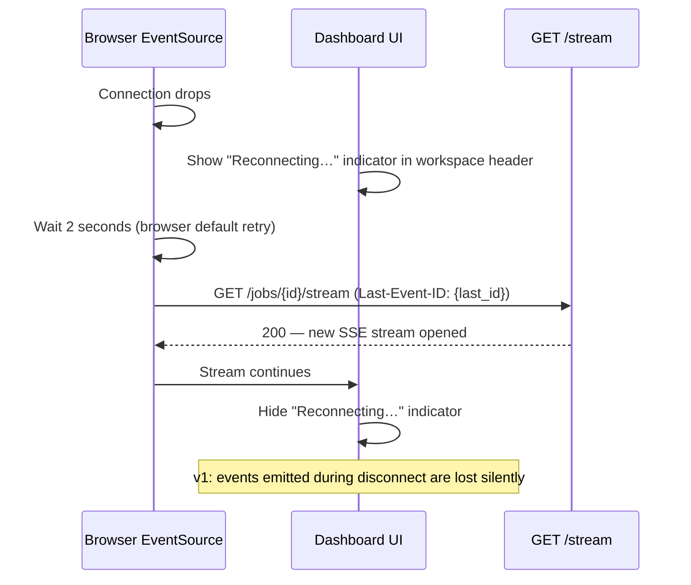
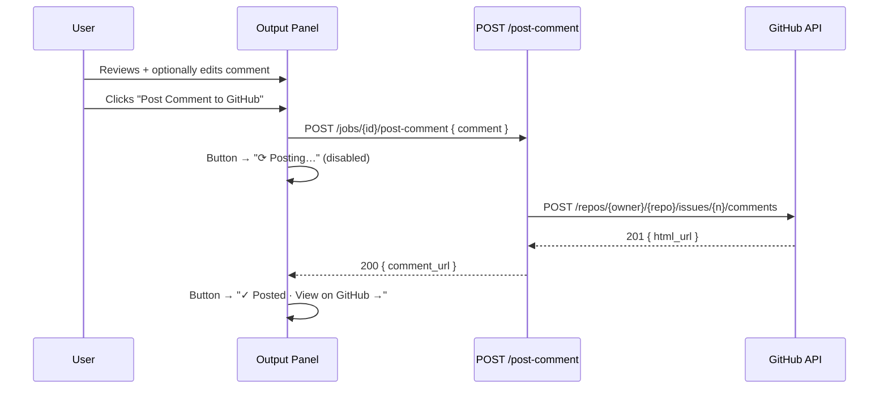

# PRD-002-3 — Interactions, Flows & Accessibility

| Field        | Value                                      |
|--------------|--------------------------------------------|
| Document ID  | PRD-002-3                                  |
| Version      | 1.0                                        |
| Status       | DRAFT                                      |
| Date         | March 2026                                 |
| Parent Doc   | [PRD-002](PRD-002-frontend-ux.md)          |

> **Part of:** [PRD-002-1 Design System](PRD-002-1-design-system.md) ·
> [PRD-002-2 Pages & Wireframes](PRD-002-2-pages-and-wireframes.md)

---

## 1. Job Lifecycle State Machine



**Terminal states:** `DONE`, `FAILED`, `CANCELLED`.

**Notes:**

- `PAUSING` is a client-side-only optimistic state, set immediately on `POST /pause` 200 response.
- `PAUSING → WAITING` occurs when the graph reaches the next supervisor boundary and emits `graph.paused`.
- `PAUSING → RUNNING` occurs when pause is cancelled before the boundary (e.g., via `graph.resumed` if
  the backend discards the pause flag — v1 edge case).
- `WAITING → RUNNING` requires **both** a 200 from `POST /answer` and the subsequent `graph.resumed` SSE.
  The transition is only applied once the SSE arrives; the 200 alone just moves the UI to a "sending…" state.

---

## 2. Modal: New Job

### Wireframe

```
╔════════════════════════════════════════════════════╗
║  ░░░░░░░░░░░░░░░░░░░░░░░░░░░░░░░░░░░░░░░░░░░░░░░  ║  ← blur backdrop
║  ┌────────────────────────────────────────────┐    ║
║  │  New Job                               [✕] │    ║
║  ├────────────────────────────────────────────┤    ║
║  │                                            │    ║
║  │  GitHub Issue URL *                        │    ║
║  │  ┌──────────────────────────────────────┐  │    ║
║  │  │ https://github.com/owner/repo/       │  │    ║
║  │  │ issues/123                           │  │    ║
║  │  └──────────────────────────────────────┘  │    ║
║  │                                            │    ║
║  │  Supervisor Notes  (optional)              │    ║
║  │  ┌──────────────────────────────────────┐  │    ║
║  │  │ Any context for the supervisor…      │  │    ║
║  │  │                                      │  │    ║
║  │  └──────────────────────────────────────┘  │    ║
║  │  max 500 chars                             │    ║
║  │                                            │    ║
║  │             [Cancel]  [Submit Job]         │    ║
║  └────────────────────────────────────────────┘    ║
╚════════════════════════════════════════════════════╝
```

### Field Validation

| Field       | Condition              | Error message                                                            |
|-------------|------------------------|--------------------------------------------------------------------------|
| issue_url   | Empty on submit        | `"Required"`                                                             |
| issue_url   | Not a GitHub issue URL | `"Must be a GitHub issue URL (github.com/owner/repo/issues/N)"`         |
| issue_url   | Network error          | Inline error banner: `"Failed to submit. Check your connection."`        |
| notes       | > 500 chars            | Textarea border turns red; submit button disabled                        |

Validation runs on blur for `issue_url` and live (on change) for the `notes` char count.

### Submit Sequence



**On error (non-200):** Modal stays open. Inline error banner appears above the action buttons. Submit button returns to idle.

### Modal States

| State       | Submit button        | Fields        |
|-------------|----------------------|---------------|
| idle        | "Submit Job" enabled | Editable      |
| submitting  | Spinner + disabled   | Read-only     |
| error       | "Submit Job" enabled | Editable      |

### Keyboard Behavior

| Key     | Action                                    |
|---------|-------------------------------------------|
| Tab     | URL input → Notes textarea → Submit → Cancel |
| Enter   | Submits form (when focus on URL or Submit) |
| Escape  | Closes modal (calls `onClose`)            |

---

## 3. Modal: Redirect Agent

### Wireframe

```
┌────────────────────────────────────────────────┐
│  Redirect Supervisor                       [✕] │
├────────────────────────────────────────────────┤
│                                                │
│  New instruction for the supervisor agent:     │
│  ┌──────────────────────────────────────────┐  │
│  │ Focus only on the auth module and skip   │  │
│  │ the database layer investigation.        │  │
│  │                                          │  │
│  └──────────────────────────────────────────┘  │
│                                    147 / 500   │  ← live char counter
│                                                │
│                  [Cancel]  [Redirect]          │
└────────────────────────────────────────────────┘
```

- Textarea: max 500 chars. Live counter shown bottom-right of textarea: `"{n} / 500"`.
- Counter turns red when > 500 chars.

### Submit Flow

On `[Redirect]` click:

1. `POST /jobs/{id}/redirect` with `{ instruction: string }`
2. On 200: modal closes + toast `"Instruction sent"` (info variant) + job status remains RUNNING.
3. On 422 / 500: modal stays open + inline error banner below textarea. "Redirect" button returns to idle.

---

## 4. Modal: Kill Confirmation

### Wireframe

```
┌────────────────────────────────────────────────┐
│  Kill Job?                                 [✕] │
├────────────────────────────────────────────────┤
│                                                │
│       ⚠                                        │
│                                                │
│       Kill this job?                           │
│                                                │
│       All agent execution will stop            │
│       immediately. This cannot be undone.      │
│                                                │
│               [Cancel]  [Kill Job]             │
│                                                │
└────────────────────────────────────────────────┘
```

"Kill Job" button is `destructive` variant (red).

**Important:** The Enter key does **NOT** submit this modal. The user must click "Kill Job" with the mouse or Space/Enter when the button has explicit keyboard focus. This prevents accidental destruction by rapid keyboard navigation.

### Confirm Flow

On `[Kill Job]` click:

1. `POST /jobs/{id}/kill`
2. On 200: modal closes + job status → `CANCELLED` + control bar hidden.
3. On error: modal stays open + inline error. Button returns to idle.

---

## 5. HITL Answer Flow



### Edge Cases

**POST /answer fails:**

- QuestionCard shows inline error below the textarea: `"Failed to send. Please try again."`
- "Continue →" button returns to idle state.
- Textarea remains editable. User can retry.

**HITL timeout (10 minutes with no answer):**

- `job.failed` SSE arrives with `reason: "hitl_timeout"`.
- QuestionCard is replaced with an error state card:

```
┌───────────────────────────────────────────────┐  ← red border
│  ✕  Session timed out.                        │
│                                               │
│  Restart the job to try again.                │
└───────────────────────────────────────────────┘
```

---

## 6. SSE Reconnect Flow



**During disconnect:** A subtle `"Reconnecting…"` label appears in the workspace header (replaces connection status pill or appears below the workspace title). Color: `--color-text-muted`.

**After reconnect:** Indicator disappears, stream continues from the current state.

**Edge case — 401 on reconnect:**

- `EventSource` receives 401 response.
- Frontend closes the `EventSource` and redirects to `/login`.
- This follows the token expiry handling described in PRD-008.

---

## 7. GitHub Write-Back Flow

### Step-by-Step

1. Job completes; Writer agent streams output to Zone 3.
2. User reviews the GitHub comment draft in the textarea (editable).
3. User optionally edits the comment text.
4. User clicks **"Post Comment to GitHub"**.
5. Frontend calls `POST /jobs/{id}/post-comment` with `{ comment: string }`.
6. Button enters loading state (`"⟳ Posting…"`, disabled).
7. Backend calls GitHub API using stored OAuth token.
8. Backend returns `{ comment_url: string }`.
9. Button replaced with `"✓ Posted · View on GitHub →"` (external link).

### Sequence Diagram



### Error Handling

If `POST /post-comment` returns a non-200:

- Button returns to idle (`"Post Comment to GitHub"`).
- Toast notification: `"Failed to post. Check GitHub connection."` (error variant).
- Comment textarea remains editable; user can retry.

---

## 8. Keyboard Shortcuts & Navigation

### Global Shortcuts (when no modal is open)

| Key        | Action                                                              |
|------------|---------------------------------------------------------------------|
| `N`        | Open New Job modal                                                  |
| `Escape`   | Close open modal or dropdown                                        |
| `P`        | Pause / Resume active job (if one selected and RUNNING or PAUSING) |
| `K`        | Open Kill Confirmation modal (if active job selected)              |
| `↑` / `↓` | Navigate job list (moves focus and selection)                       |
| `Enter`    | Select focused job card (loads in workspace)                        |

### Tab Order by Section

**Login page:**

1. "Continue with GitHub" button

**Dashboard — Zone 1 (Job Sidebar):**

1. Status filter dropdown
2. Repo filter dropdown
3. Sort toggle
4. "+ New Job" button
5. Job cards (top to bottom)

**Dashboard — Zone 2 (Workspace), Running state:**

1. Redirect button
2. Pause / Resume button
3. Kill button

**Dashboard — Zone 2 (Workspace), HITL state:**

1. QuestionCard textarea
2. "Continue →" button

**Dashboard — Zone 3 (Output Panel), Done state:**

1. GitHub Comment textarea
2. Preview tab toggle
3. "Post Comment" button
4. "Create Issue" button
5. "Copy Report" button
6. "View in LangSmith" link

**Settings page:**

1. "Disconnect GitHub" / "Connect GitHub" button
2. "Log out" button

### Focus Management

| Event          | Focus behavior                                                     |
|----------------|--------------------------------------------------------------------|
| Modal opens    | Focus moves to the first focusable element inside the modal       |
| Modal closes   | Focus returns to the element that triggered the modal             |
| Job card selected via keyboard | Focus moves to the Redirect button in the workspace header |
| QuestionCard appears | Focus moves to the QuestionCard textarea (`aria-live="assertive"` announces) |
| QuestionCard dismissed | Focus returns to the workspace header                      |

---

## 9. ARIA & Accessibility Map

| Component              | Role            | aria-label / aria-labelledby               | aria-live | Notes                                              |
|------------------------|-----------------|--------------------------------------------|-----------|----------------------------------------------------|
| Job Queue Sidebar list | `list`          | `aria-label="Job queue"`                   | —         |                                                    |
| Job card               | `listitem`      | `aria-label="{status}: {issue title}"`     | —         | Status must be in label, not just color            |
| Selected job card      | `listitem`      | + `aria-selected="true"`                   | —         |                                                    |
| Live workspace         | `region`        | `aria-label="Live workspace"`              | `polite`  | Agent output tokens appended to this region        |
| Agent card text        | —               | —                                          | inherited | Tokens appended to parent live region; rate-throttled (max 1 announce/500ms) |
| QuestionCard           | `alertdialog`   | `aria-labelledby="question-title"`         | `assertive` | Urgent — interrupts current announcement          |
| QuestionCard textarea  | `textbox`       | `aria-label="Your answer"`                 | —         | `aria-required="true"`                             |
| StatusBadge            | —               | `aria-label="{STATUS}"`                    | —         | Color alone is not sufficient for a11y             |
| Execution timeline     | `list`          | `aria-label="Execution timeline"`          | `polite`  | Node state changes announced                       |
| Timeline node          | `listitem`      | `aria-label="{node_name}: {state}"`        | —         |                                                    |
| Modal (all)            | `dialog`        | `aria-modal="true"` + `aria-labelledby`    | —         | Focus trapped while open                           |
| Kill modal             | `alertdialog`   | `aria-describedby="kill-warning-text"`     | —         | `id="kill-warning-text"` on the destructive subtext |
| Output Panel           | `region`        | `aria-label="Output panel"`                | `polite`  | Section content updates announced                  |
| Toast container        | `log`           | `aria-label="Notifications"`               | `polite`  | Each toast appended as a `listitem`                |
| Error toast            | —               | —                                          | `assertive` | Override for error severity                      |
| Topbar connection pill | `status`        | `aria-label="Connection status: {state}"`  | `polite`  | Announced on status change                         |
| Avatar dropdown        | `menu`          | `aria-label="User menu"`                   | —         | `menuitem` role for each item                      |

---

## 10. Animation Specs

| Name              | Trigger                        | Duration  | Easing      | CSS Property Animated               | Notes                                    |
|-------------------|--------------------------------|-----------|-------------|--------------------------------------|------------------------------------------|
| card-appear       | Job card added to list         | 200ms     | ease-out    | `opacity` 0→1, `translateY` 8px→0   | Triggered on mount                       |
| agent-spawn       | `agent.spawned` SSE            | 300ms     | ease-out    | `opacity` 0→1, `translateY` 12px→0  | AgentCard entrance                       |
| question-pulse    | QuestionCard rendered          | 2s        | ease-in-out | `box-shadow` amber glow (infinite)   | Stops when QuestionCard is dismissed     |
| status-pulse      | RUNNING or WAITING badge       | 1.5s      | ease-in-out | `opacity` 0.5→1 (infinite)           | On dot element only                      |
| skeleton-shimmer  | SkeletonBlock mounted          | 1.5s      | linear      | `background-position` (infinite)     | Gradient sweep left-to-right             |
| stream-cursor     | AgentCard in running state     | 0.7s      | step-start  | `opacity` 1→0 (infinite)             | Cursor `▌` blink effect                  |
| modal-in          | Modal opened                   | 150ms     | ease-out    | `opacity` + `scale` 0.96→1           | Backdrop fades simultaneously            |
| toast-in          | Toast shown                    | 250ms     | spring      | `translateY` + `opacity`             | Slides up from bottom-right              |
| card-remove       | Job card removed from list     | 150ms     | ease-in     | `opacity` 1→0, `translateY` 0→-4px  | Before DOM removal                       |
| question-fade-out | QuestionCard dismissed         | 200ms     | ease-in     | `opacity` 1→0, `translateY` 0→-8px  | After `graph.resumed` SSE                |

**Reduced motion:** All animations respect `prefers-reduced-motion: reduce`. When set, durations drop to ≤ 1ms (effectively instant). Infinite animations (pulse, shimmer, cursor) are disabled entirely — replaced with static visual state.
