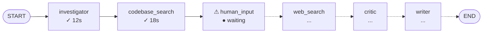
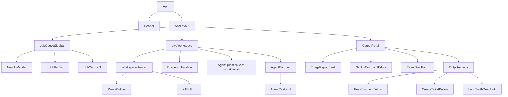

# PRD-002 — Frontend & User Experience

| Field        | Value                                                                                                                        |
|--------------|------------------------------------------------------------------------------------------------------------------------------|
| Document ID  | PRD-002                                                                                                                      |
| Version      | 1.0                                                                                                                          |
| Status       | DRAFT                                                                                                                        |
| Date         | March 2026                                                                                                                   |
| Parent Doc   | [PRD-001](PRD-001-master-overview.md)                                                                                        |
| Related Docs | [PRD-003](PRD-003-langgraph-orchestration.md) (Human-in-the-Loop), [PRD-005](PRD-005-langsmith-observability.md) (LangSmith) |

---

## Overview

The AgentOps Dashboard frontend is a **Jira-inspired single-page application** that makes multi-agent AI execution
visible, interactive, and controllable in real time. The UI is intentionally modeled after issue tracking tools because:

- Developers already understand the mental model (jobs as tickets, agents as assignees, outputs as comments)
- Jira-style layouts communicate status, priority, and progress at a glance
- The ticket metaphor maps cleanly onto LangGraph's job lifecycle (queued → running → waiting → done)

The frontend connects to the FastAPI backend via **Server-Sent Events (SSE)** for live streaming and standard REST calls
for user actions (submit job, answer agent question, pause/kill agent).

---

## Design Principles

| Principle                      | Description                                                                                                                                        |
|--------------------------------|----------------------------------------------------------------------------------------------------------------------------------------------------|
| **Live by default**            | Every job view is streaming. There is no "refresh" — the UI updates as agents execute.                                                             |
| **Trust through transparency** | Users see every agent's reasoning, not just the final answer. Opacity kills trust in AI systems.                                                   |
| **Human always in control**    | Pause, redirect, and kill controls are always visible. Agents cannot take irreversible actions (GitHub write-back) without explicit user approval. |
| **Familiar, not novel**        | The Jira mental model is intentional. Developers should feel oriented immediately, not confronted with a new paradigm.                             |
| **Progressive disclosure**     | High-level status in the job list; full detail in the workspace; raw traces via LangSmith deep-link. Not everything needs to be visible at once.   |

---

## Application Layout

The application is a three-zone layout, always visible simultaneously on desktop (≥1280px wide):

| Zone 1 — Job Queue (25%)   | Zone 2 — Live Workspace (50%)          | Zone 3 — Output Panel (25%)   |
|----------------------------|----------------------------------------|-------------------------------|
| Ticket cards with statuses | Agent cards streaming in real time     | Final triage report           |
| Filter bar                 | Agent question cards (amber, blocking) | GitHub comment draft          |
| New Job button             | Execution timeline                     | Ticket draft + Post to GitHub |
|                            |                                        | View in LangSmith link        |

---

## Zone 1 — Job Queue Sidebar

### Purpose

Displays all submitted triage jobs as ticket cards, analogous to Jira's issue list. Clicking a job loads it in Zone 2
and 3.

### Job Card Structure

Each card shows:

```text
┌─────────────────────────────────────────┐
│ ● RUNNING                    #1042      │
│ Auth token expiry causes 500 on /api/me │
│ github.com/org/repo                     │
│ Submitted 4 min ago    3 agents active  │
└─────────────────────────────────────────┘
```

| Field               | Description                                                                                                           |
|---------------------|-----------------------------------------------------------------------------------------------------------------------|
| Status badge        | Color-coded: QUEUED (gray), RUNNING (blue, animated), WAITING (amber — needs human input), DONE (green), FAILED (red) |
| Issue title         | Truncated GitHub issue title                                                                                          |
| Repository          | `org/repo` short form                                                                                                 |
| Timestamp           | Relative time since submission                                                                                        |
| Active agents count | Only shown when RUNNING                                                                                               |

### Status Definitions

| Status  | LangGraph State             | Color                  | Description                            |
|---------|-----------------------------|------------------------|----------------------------------------|
| QUEUED  | Thread created, not started | Gray                   | Job submitted, waiting for resources   |
| RUNNING | Graph executing             | Blue (pulse animation) | At least one agent node is active      |
| WAITING | `interrupt()` fired         | Amber (pulse)          | Graph paused — user answer required    |
| DONE    | Graph reached END node      | Green                  | All outputs produced                   |
| FAILED  | Unhandled exception         | Red                    | Job errored; LangSmith trace available |

### Interactions

- **Click job card** → loads workspace in Zone 2/3
- **New Job button** → opens a modal: paste GitHub issue URL, optional notes to supervisor, submit
- **Filter bar** (top of sidebar): filter by status, repository, or date

---

## Zone 2 — Live Workspace

### Purpose

The center panel is the heart of the product. It shows the active job's execution in real time: each agent's activity,
reasoning, tool calls, and outputs stream in as they happen. This is where the Jira analogy extends: the workspace is
like a Jira ticket that writes itself, section by section, as agents work.

### Workspace Header

```text
┌────────────────────────────────────────────────────────────────┐
│  #1042  Auth token expiry causes 500 on /api/me                │
│  github.com/org/repo · Opened by @user · 2 hours ago          │
│                        [↪ Redirect]  [⏸ Pause]  [✕ Kill]  │
└────────────────────────────────────────────────────────────────┘
```

### Agent Cards

Each active or completed agent gets an **Agent Card** in the workspace. Cards appear as agents are spawned and fill in
as they execute:

```text
┌────────────────────────────────────────────────────────────────┐
│  🔍  INVESTIGATOR AGENT                    ● DONE  (12s)      │
├────────────────────────────────────────────────────────────────┤
│  Reading issue body...                                         │
│  Identified error: HTTP 500 on authenticated endpoint          │
│  Hypothesis forming: likely JWT validation or middleware issue │
│                                                                │
│  → Passed to: Codebase Searcher, Web Search Agent             │
└────────────────────────────────────────────────────────────────┘
```

Agent Card states:

| State           | Visual                                                           |
|-----------------|------------------------------------------------------------------|
| Spawning        | Card fades in with a shimmer skeleton                            |
| Running         | Animated "typing" indicator; text streams in token by token      |
| Waiting on tool | Shows tool name: `🔧 Searching codebase for "JWT middleware"...` |
| Done            | Green checkmark; elapsed time shown                              |
| Error           | Red border; error message; link to LangSmith trace               |

### Agent Question Cards

When the supervisor decides to ask the user a question, a **question card** appears above all other agents, with amber
styling to communicate urgency. The entire graph is paused until the user responds.

```text
┌────────────────────────────────────────────────────────────────┐
│  ⚠  SUPERVISOR NEEDS YOUR INPUT               ● WAITING       │
├────────────────────────────────────────────────────────────────┤
│  The error appears in two separate code paths:                 │
│                                                                │
│  (A) auth/middleware.py — JWT token validation                 │
│  (B) db/session.py — Database connection pooling               │
│                                                                │
│  Which code path should agents prioritize for deep analysis?   │
│                                                                │
│  ┌──────────────────────────────────────────────────────────┐ │
│  │ Type your answer here...                                  │ │
│  └──────────────────────────────────────────────────────────┘ │
│                                           [Continue →]         │
└────────────────────────────────────────────────────────────────┘
```

Full specification in **[PRD-003](PRD-003-langgraph-orchestration.md)**.

### Execution Timeline

Below the agent cards, a compact horizontal timeline shows the sequence of node executions:



This is the most direct visualization of the LangGraph graph state — nodes light up as they complete.

---

## Zone 3 — Output Panel

### Purpose

The right panel accumulates the final structured outputs as the Writer agent produces them. Content is editable before
any GitHub write-back occurs.

### Structured Report Card

```text
TRIAGE REPORT

Severity:    🔴 HIGH
Category:    Authentication / Token Handling
Confidence:  87%

Root Cause:
  JWT expiry check in auth/middleware.py:L142 does not
  account for timezone offset. Token appears valid locally
  but fails on UTC server time.

Relevant Files:
  · auth/middleware.py (lines 138–155)
  · tests/test_auth.py (missing expiry edge case)
  · config/jwt_settings.py

Similar Past Issues:
  · #891 — Fixed 2024-11 (same root cause, different endpoint)
```

### GitHub Comment Draft

A text area, pre-populated by the Writer agent, editable by the user:

```markdown
## 🤖 AgentOps Triage — Issue #1042

**Severity:** High
**Root Cause:** JWT timezone handling bug in `auth/middleware.py:142`

The token expiry check uses local time instead of UTC...
[full comment text]

---
*Triaged by AgentOps Dashboard · [View full trace](#)*
```

### Ticket Draft

A structured form (also pre-filled by Writer agent):

| Field               | Value                                                           |
|---------------------|-----------------------------------------------------------------|
| Title               | `[Bug] JWT expiry fails on UTC server — auth/middleware.py:142` |
| Labels              | `bug`, `authentication`, `high-priority`                        |
| Assignee suggestion | `@backend-team`                                                 |
| Effort estimate     | `M (2–4 hours)`                                                 |

### Action Buttons

- **Post Comment to GitHub** — posts the comment draft to the original issue (requires GitHub auth)
- **Create GitHub Issue** — creates a new ticket with the ticket draft fields
- **Copy Report** — copies the structured report as markdown
- **View in LangSmith** — deep-link to the full job trace in LangSmith (
  see [PRD-005](PRD-005-langsmith-observability.md))

---

## Streaming Architecture

### SSE Event Types

The FastAPI backend emits the following event types over the SSE stream. Every
message is emitted with an SSE `id:` field set to a per-job monotonically
incrementing integer (e.g. `id: 42`). On reconnect the browser sends this value
as the `Last-Event-ID` header automatically. **v1 behavior:** the backend
reconnects the stream but does not replay missed events — Redis Pub/Sub has no
message history, so events emitted during the disconnect window are silently
lost. Gapless resume (e.g., via Redis Streams or a DB event log) is a v2
concern.
See [PRD-008 §Token Expiry During an Active Stream](PRD-008-authentication.md#token-expiry-during-an-active-stream) for
the token-expiry
reconnect flow.

| Event                 | Payload                                   | Frontend Action                     |
|-----------------------|-------------------------------------------|-------------------------------------|
| `job.started`         | `{ job_id, issue_url, issue_title }`      | Create job card, open workspace     |
| `agent.spawned`       | `{ agent_name, agent_id }`                | Create new agent card with skeleton |
| `agent.token`         | `{ agent_id, token }`                     | Append token to agent card text     |
| `agent.tool_call`     | `{ agent_id, tool_name, input }`          | Show tool indicator on agent card   |
| `agent.tool_result`   | `{ agent_id, tool_name, result_summary }` | Update tool indicator to done       |
| `agent.done`          | `{ agent_id, elapsed_ms }`                | Mark agent card as done with time   |
| `graph.interrupt`     | `{ question, context }`                   | Show question card, amber status    |
| `graph.resumed`       | `{}`                                      | Remove question card, resume status |
| `graph.node_complete` | `{ node_name }`                           | Update timeline                     |
| `output.token`        | `{ section, token }`                      | Stream into output panel section    |
| `job.done`            | `{ report, comment_draft, ticket_draft }` | Finalize output panel, green status |
| `job.failed`          | `{ error, langsmith_url }`                | Red status, show error card         |

### Frontend State Management

State is managed with **Zustand**. Each job has its own state slice:

```typescript
interface JobState {
    id: string
    status: 'queued' | 'running' | 'waiting' | 'done' | 'failed'
    agents: AgentCardState[]
    timelineNodes: TimelineNode[]
    pendingQuestion: Question | null
    report: StructuredReport | null
    commentDraft: string
    ticketDraft: TicketDraft | null
    langsmithUrl: string | null
}
```

---

## GitHub Write-Back Flow

Write-back to GitHub is always a **manual, user-initiated action**. The flow:

1. Writer agent produces comment draft and ticket draft
2. User reviews and edits both in Zone 3
3. User clicks "Post Comment to GitHub"
4. Frontend calls `POST /jobs/{id}/post-comment` with final comment text
5. Backend posts to GitHub API using stored OAuth token
6. UI shows confirmation with link to the GitHub comment

**No agent can post to GitHub autonomously.** This is a hard constraint in v1.0.

---

## Component Tree



---

## Tech Stack

| Concern          | Choice                     | Rationale                                                           |
|------------------|----------------------------|---------------------------------------------------------------------|
| Framework        | React 18 + TypeScript      | Component model matches streaming UI patterns well                  |
| State management | Zustand                    | Lightweight, no boilerplate, works perfectly with streaming updates |
| Streaming        | Native `EventSource` (SSE) | Server-push only; simpler than WebSockets for this use case         |
| Styling          | Tailwind CSS               | Utility-first, fast iteration on the Jira-like layout               |
| HTTP client      | Axios                      | Clean REST calls for submit/answer/pause/kill                       |
| Build tool       | Vite                       | Fast HMR, modern ESM                                                |

---

## Non-Functional Requirements

| Requirement                         | Target                                                                                       |
|-------------------------------------|----------------------------------------------------------------------------------------------|
| Time to first streaming token in UI | < 5 seconds from job submission                                                              |
| SSE reconnect on drop               | Automatic, within 2 seconds; v1 may miss events emitted during disconnect window (no replay) |
| Concurrent jobs in UI               | Support up to 10 simultaneously with no performance degradation                              |
| Browser support                     | Chrome 110+, Firefox 115+, Safari 16+                                                        |
| Accessibility                       | WCAG 2.1 AA for all static content; streaming regions use `aria-live="polite"`               |
| Responsive layout                   | Full functionality at 1280px+; graceful degradation at 1024px                                |
