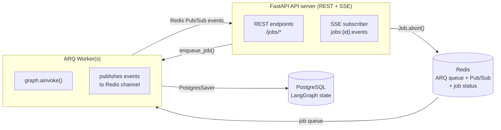

# PRD-003 — LangGraph Orchestration & Human-in-the-Loop

| Field        | Value                                             |
|--------------|---------------------------------------------------|
| Document ID  | PRD-003                                           |
| Version      | 1.0                                               |
| Status       | DRAFT                                             |
| Date         | March 2026                                        |
| Parent Doc   | [PRD-001](PRD-001-master-overview.md)             |
| Related Docs | [PRD-002](PRD-002-frontend-ux.md) (Frontend), [PRD-004](PRD-004-agent-layer.md) (LangChain/LangServe) |

---

## Overview

This document specifies the LangGraph orchestration layer of AgentOps Dashboard — the system's brain. It covers how the
supervisor coordinates worker agents, how shared state flows through the graph, how human interrupts are handled, and
how job state is persisted across sessions.

> **Detailed specs:** [Event Pipeline & Worker](PRD-003-1-event-pipeline.md) ·
> [Supervisor Prompt & Routing](PRD-003-2-supervisor-spec.md)

LangGraph is used here in its intended role: **low-level orchestration of long-running, stateful, multi-agent workflows
**. It is deliberately not used for simple linear chains (those live in LangChain/LCEL at the LangServe layer — see
[PRD-004](PRD-004-agent-layer.md)).

---

## LangGraph Fundamentals Used

| Concept           | Usage in This Product                                                                                                                     |
|-------------------|-------------------------------------------------------------------------------------------------------------------------------------------|
| `StateGraph`      | The main graph class; holds the shared `BugTriageState` (Pydantic `BaseModel`) across all nodes                                           |
| Nodes             | Each agent and decision point is a node: `supervisor`, `investigator`, `codebase_search`, `web_search`, `critic`, `human_input`, `writer` |
| Conditional edges | Supervisor's output determines which worker runs next via `add_conditional_edges`                                                         |
| `interrupt()`     | Pauses graph execution mid-node to await human input; resumes via `Command(resume=answer)`                                                |
| Checkpointer      | `SqliteSaver` (dev) / `PostgresSaver` (prod) — persists full graph state so jobs survive restarts                                         |
| Thread ID         | Each triage job maps to a LangGraph thread; jobs are fully isolated                                                                       |
| Streaming         | `graph.astream_events()` runs inside the ARQ worker; the API server is a pure Redis Pub/Sub consumer                                      |
| ARQ               | Async Redis Queue — distributed job execution, cross-worker `Job.abort()`, built-in status tracking (QUEUED / IN_PROGRESS / COMPLETE / FAILED) |
| Redis Pub/Sub     | Event fanout channel (`jobs:{id}:events`) — worker publishes events, SSE endpoint subscribes; supports multiple simultaneous subscribers  |

---

## Shared State Schema

The `BugTriageState` Pydantic model is the central data structure. Every node reads from and writes to this state. It is
persisted at every checkpoint.

```python
from __future__ import annotations

from typing import Annotated
from pydantic import BaseModel, Field, model_validator

# CriticVerdict is defined in PRD-004-1 §7 (agent-chains) and imported here.
# It provides the binary APPROVED/REJECTED gate used by the supervisor for routing.
from agentops.agents.critic import CriticVerdict


class AgentFinding(BaseModel):
    agent_name: str
    summary: str
    details: str
    confidence: float  # 0.0 – 1.0
    relevant_files: list[str]


class HumanExchange(BaseModel):
    question: str
    context: str
    answer: str | None = None


class TriageReport(BaseModel):
    severity: str  # LOW / MEDIUM / HIGH / CRITICAL
    category: str
    root_cause: str
    relevant_files: list[str]
    similar_issues: list[str]
    confidence: float


_CURRENT_SCHEMA_VERSION = 1


class BugTriageState(BaseModel):
    """
    Central graph state. Persisted by LangGraph's checkpointer after every node execution.

    Schema evolution rules:
    - Adding a field: add it with a Field(default=...) default. Pydantic fills missing keys
      from old checkpoints automatically at deserialization — no migration code required.
    - Renaming or changing the type of a field: add a branch inside migrate_from_checkpoint()
      and bump _CURRENT_SCHEMA_VERSION.
    """

    # --- Issue metadata ---
    issue_url: str
    issue_title: str
    issue_body: str
    repository: str

    # --- Routing ---
    current_node: str = Field(default="")
    next_node: str | None = Field(default=None)
    supervisor_reasoning: str = Field(default="")
    supervisor_confidence: float = Field(default=0.0)
    iterations: int = Field(default=0)   # total node executions; not reset on resume
    max_iterations: int = Field(default=12)
    paused: bool = Field(default=False)
    redirect_instructions: Annotated[list[str], lambda a, b: a + b] = Field(default_factory=list)

    # --- Agent outputs ---
    findings: Annotated[list[AgentFinding], lambda a, b: a + b] = Field(default_factory=list)
    critic_feedback: CriticVerdict | None = Field(default=None)
    # Set by critic node. Supervisor reads .verdict to gate writer routing:
    # APPROVED → route to writer; REJECTED → re-investigate per .gaps and .required_evidence.

    # --- Human-in-the-loop ---
    human_exchanges: Annotated[list[HumanExchange], lambda a, b: a + b] = Field(default_factory=list)
    pending_exchange: HumanExchange | None = Field(default=None)
    awaiting_human: bool = Field(default=False)

    # --- Collected context ---
    codebase_chunks: list[str] = Field(default_factory=list)
    similar_past_issues: list[str] = Field(default_factory=list)
    web_results: list[str] = Field(default_factory=list)

    # --- Outputs ---
    report: TriageReport | None = Field(default=None)
    github_comment_draft: str | None = Field(default=None)
    ticket_draft: dict[str, object] | None = Field(default=None)

    # --- Cost tracking ---
    running_cost_usd: float = Field(default=0.0)
    max_cost_usd: float = Field(default=5.0)
    cost_budget_exceeded: bool = Field(default=False)

    # --- Job metadata ---
    job_id: str
    owner_id: str
    langsmith_run_id: str | None = Field(default=None)
    status: str = Field(default="queued")

    # --- Schema versioning ---
    schema_version: int = Field(default=0)
    # 0 = pre-versioning checkpoint; always written as CURRENT_SCHEMA_VERSION by
    # migrate_from_checkpoint() on the first supervisor execution after a schema bump.

    @model_validator(mode="before")
    @classmethod
    def migrate_from_checkpoint(cls, data: object) -> object:
        """
        Runs before Pydantic field validation on every deserialization.
        For additive schema changes this method does nothing — Pydantic fills Field
        defaults automatically. Add a branch here only when a field is renamed or its
        type changes in a breaking way, then bump _CURRENT_SCHEMA_VERSION.
        """
        if not isinstance(data, dict):
            return data

        # Example (not yet needed): if the field "web_results" was renamed from
        # "search_results" in schema v2, the branch would be:
        #
        #   if data.get("schema_version", 0) < 2 and "search_results" in data:
        #       data["web_results"] = data.pop("search_results")
        #
        data["schema_version"] = _CURRENT_SCHEMA_VERSION
        return data

    model_config = {"arbitrary_types_allowed": True}
```

### Schema Versioning

`BugTriageState` uses Pydantic `BaseModel` rather than `TypedDict` specifically to leverage
Pydantic's deserialization lifecycle for checkpoint compatibility.

**Additive changes (adding a new field):** Supply a `Field(default=...)` or
`Field(default_factory=...)`. LangGraph's checkpointer passes the stored JSON dict to Pydantic,
which fills any missing key with its declared default. No migration code is required.

**Non-additive changes (renaming a field, incompatible type change):** Add a conditional branch
inside `migrate_from_checkpoint()` guarded by `data.get("schema_version", 0) < N`, then bump
`CURRENT_SCHEMA_VERSION`. The validator is a classmethod on `BugTriageState` — no module-level
functions or global registries.

**`schema_version`** starts at `0` in all pre-versioning checkpoints (the field is absent, so
Pydantic uses `Field(default=0)`). `migrate_from_checkpoint()` always writes
`CURRENT_SCHEMA_VERSION` into the dict before field validation, so after the first supervisor
execution following a schema bump the checkpoint is updated automatically.

**`_CURRENT_SCHEMA_VERSION`** is a module-level constant defined immediately above `BugTriageState`
so it is always co-located with the class it describes.

---

## Graph Structure

### Node List

| Node              | Type           | Description                                              |
|-------------------|----------------|----------------------------------------------------------|
| `START`           | Built-in       | Entry point                                              |
| `supervisor`      | LLM node       | Reads current state; decides next step                   |
| `investigator`    | Tool node      | Calls LangServe `/agents/investigator`                   |
| `codebase_search` | Tool node      | Calls LangServe `/agents/codebase-search`                |
| `web_search`      | Tool node      | Calls LangServe `/agents/web-search`                     |
| `critic`          | Tool node      | Calls LangServe `/agents/critic`                         |
| `human_input`     | Interrupt node | Fires `interrupt()`; blocks until user answers           |
| `writer`          | Tool node      | Calls LangServe `/agents/writer`; produces final outputs |
| `END`             | Built-in       | Exit point                                               |

### Graph Definition (Pseudocode)

```python
from langgraph.graph import StateGraph, START, END
from langgraph.checkpoint.sqlite import SqliteSaver

builder = StateGraph(BugTriageState)

builder.add_node("supervisor", supervisor_node)
builder.add_node("investigator", investigator_node)
builder.add_node("codebase_search", codebase_search_node)
builder.add_node("web_search", web_search_node)
builder.add_node("critic", critic_node)
builder.add_node("human_input", human_input_node)
builder.add_node("writer", writer_node)

builder.add_edge(START, "supervisor")

builder.add_conditional_edges(
    "supervisor",
    route_from_supervisor,
    {
        "investigator": "investigator",
        "codebase_search": "codebase_search",
        "web_search": "web_search",
        "critic": "critic",
        "human_input": "human_input",
        "writer": "writer",
        "end": END,
    }
)

for node in ["investigator", "codebase_search", "web_search", "critic"]:
    builder.add_edge(node, "supervisor")

builder.add_edge("human_input", "supervisor")
builder.add_edge("writer", END)

checkpointer = SqliteSaver.from_conn_string("jobs.db")
graph = builder.compile(checkpointer=checkpointer)
```

### Routing Logic

```python
def route_from_supervisor(state: BugTriageState) -> str:
    """
    Supervisor LLM outputs structured JSON with 'next' field.
    This function extracts it and returns the node name.
    Guards: max_iterations check, investigator-first enforcement.
    """
    if state["iterations"] >= state["max_iterations"]:
        return "writer"  # force completion

    # Enforce design invariant: investigator must always run first.
    # The supervisor prompt instructs this, but LLM compliance is not guaranteed.
    # state["iterations"] == 0 means no worker node has executed yet.
    if state["iterations"] == 0 and state["next_node"] != "investigator":
        return "investigator"

    return state["next_node"]
```

`iterations` counts total worker-node executions across the full job lifetime, including any
cycles that occur after a human-interrupt resume. The value `max_iterations` is chosen to
accommodate a typical flow (investigation → optional human interrupt → continued investigation
→ write) without premature termination. It is **not** reset on resume.

**Investigator-first guard:** When `iterations == 0`, no worker node has yet executed. The
supervisor prompt instructs the LLM to always call `investigator` first, but prompt compliance
is not guaranteed — edge-case inputs or model drift could cause the LLM to skip straight to
`codebase_search` or `writer`. The guard in `route_from_supervisor` overrides any such decision
deterministically. Once `investigator` has run, `iterations` becomes 1 and the guard no longer
fires; subsequent routing is left entirely to the supervisor.

---

## Supervisor Agent Design

The supervisor is the most critical node. It reads the full current state and decides:

1. Which worker to call next (or whether to ask the human, or to finalize)
2. Whether it has enough information to write the final report
3. Whether it needs to ask the user a clarifying question

### Supervisor System Prompt (Abbreviated)

```
You are the supervisor of a bug triage team. You coordinate specialized agents
to investigate a GitHub issue and produce a full triage report.

Your available agents:
- investigator: Reads and interprets the issue body. Always call this first.
- codebase_search: Searches the repository for relevant code. Call when you need
  to locate the root cause in source code.
- web_search: Searches the web for error messages or stack traces. Call when the
  issue contains cryptic errors or library bugs.
- critic: Reviews findings for correctness and gaps. Call when you have a
  hypothesis but want a second opinion before finalizing.
- writer: Produces the final report. Call only when you have sufficient evidence.

Human input rules:
- Ask the user a question if and only if:
  (a) Two or more equally plausible root causes exist and you cannot distinguish them
      without user knowledge, OR
  (b) Critical context is missing that no tool can retrieve (e.g. recent deploys,
      env-specific config)
- Maximum 2 questions per job. Do not ask about things tools can discover.
- Frame questions concisely. Provide 2–3 specific options when possible.

Output JSON with fields: next_node, reasoning, question (if asking human), confidence.
```

### Supervisor Output Schema

```python
class SupervisorDecision(BaseModel):
    next_node: Literal[
        "investigator", "codebase_search", "web_search",
        "critic", "human_input", "writer", "end"
    ]
    reasoning: str
    question: str | None  # only populated when next_node == "human_input"
    question_context: str | None
    confidence: float  # 0.0–1.0
```

> When `next_node == "human_input"`, the supervisor node returns
> `{"pending_exchange": HumanExchange(question=..., context=...),
> "awaiting_human": True}`. It does **not** append to `human_exchanges` directly — that
> field is written only by `human_input_node` via the append reducer.

---

## Worker Agent Node Specs

Each worker node follows the same pattern: call the corresponding LangServe endpoint, get back an `AgentFinding`, append
it to state, return updated state to supervisor.

```python
async def investigator_node(state: BugTriageState) -> dict:
    response = await httpx.post(
        "http://localhost:8001/agents/investigator/invoke",
        json={
            "input": {
                "issue_title": state.issue_title,
                "issue_body": state.issue_body,
                "prior_findings": state.findings,
            }
        }
    )
    finding = AgentFinding(**response.json()["output"])
    return {
        "findings": [finding],  # reducer appends this
        "current_node": "investigator",
        "iterations": state.iterations + 1,
    }
```

| Node              | LangServe Endpoint        | Key Inputs from State                  | Key Outputs to State                             |
|-------------------|---------------------------|----------------------------------------|--------------------------------------------------|
| `investigator`    | `/agents/investigator`    | `issue_title`, `issue_body`            | `findings`                                       |
| `codebase_search` | `/agents/codebase-search` | `issue_body`, `findings`, `repository` | `findings`, `codebase_chunks`                    |
| `web_search`      | `/agents/web-search`      | `issue_body`, `findings`               | `findings`, `web_results`                        |
| `critic`          | `/agents/critic`          | `findings`, `codebase_chunks`          | `findings` (critique finding)                    |
| `writer`          | `/agents/writer`          | all findings, human exchanges          | `report`, `github_comment_draft`, `ticket_draft` |

---

## Human-in-the-Loop Implementation

### Triggering an Interrupt

When the supervisor routes to `human_input`, the node fires `interrupt()`:

```python
from langgraph.types import interrupt


def human_input_node(state: BugTriageState) -> dict:
    exchange = state["pending_exchange"]

    answer = interrupt({
        "question": exchange["question"],
        "context": exchange["context"],
    })

    return {
        "human_exchanges": [exchange.model_copy(update={"answer": answer})],  # reducer appends
        "pending_exchange": None,
        "awaiting_human": False,
    }
```

> **State design note:** `human_exchanges` uses an append reducer
> (`Annotated[list[HumanExchange], lambda a, b: a + b]`), so nodes may safely return
> `[new_item]` without reading or copying the existing list. `pending_exchange` uses plain
> overwrite semantics and holds at most one unanswered question at a time. The supervisor
> writes to `pending_exchange`; `human_input_node` reads it, fills the answer, appends the
> completed exchange to `human_exchanges`, and clears `pending_exchange` — no list mutation
> anywhere.

### Resuming from FastAPI

When the user submits an answer via `POST /jobs/{id}/answer`, the endpoint cancels the pending timeout ARQ job and
resumes the graph. Full implementation is in the [Interrupt Timeout Mechanism](#interrupt-timeout-mechanism) section.

`Command(resume=answer)` does not restart the graph from the beginning. LangGraph restores the
full `BugTriageState` from the checkpoint saved at the interrupt and continues execution from
the `human_input` node forward. The `iterations` counter therefore reflects work done both
before and after the interrupt.

Before resuming, the endpoint reads the checkpointed state via `graph.aget_state()` and
checks `awaiting_human`. If the job is not currently paused at a `human_input` interrupt
(e.g., the job is still running, has already completed, or the timeout already fired and
auto-resumed), the endpoint returns **HTTP 409 Conflict** rather than calling
`Command(resume=...)` on a non-interrupted thread.

### Interrupt Timeout Mechanism

`interrupt()` blocks the graph indefinitely — LangGraph has no built-in timeout. The 30-minute timeout is implemented
by enqueuing a deferred ARQ job (`expire_human_input`) with a 30-minute delay at the moment the interrupt fires. If the
user has not answered by then, the job resumes the graph with a best-effort signal via `graph.ainvoke(Command(resume=...))`.
If the user answers first, the answer endpoint cancels the deferred job via `Job.abort()` before resuming the graph.

```python
# worker.py

TIMEOUT_ANSWER = "[no answer provided — proceeding with best-effort]"
HUMAN_INPUT_TIMEOUT_SECONDS = 1800  # 30 minutes

async def expire_human_input(ctx: dict, job_id: str):
    """
    Scheduled ARQ job: fires 30 min after a human_input interrupt if unanswered.
    Resumes the graph with a best-effort signal so the supervisor can proceed.
    """
    redis: Redis = ctx["redis"]

    job = Job(job_id, redis)
    info = await job.info()
    if info is not None and info.status in (JobStatus.complete, JobStatus.not_found):
        return

    config = {"configurable": {"thread_id": job_id}}
    await graph.ainvoke(Command(resume=TIMEOUT_ANSWER), config=config)

    channel = f"jobs:{job_id}:events"
    await redis.publish(channel, json.dumps({
        "type": "human_input.timeout",
        "message": "No answer received after 30 minutes. Proceeding with best-effort.",
    }))
```

The timeout job is enqueued at the moment the ARQ worker detects the graph has paused at a `human_input` node (i.e.,
`astream_events` yields an `on_chain_end` event whose metadata indicates an interrupt):

```python
# worker.py — inside run_triage(), after the astream_events loop
async def run_triage(ctx: dict, job_id: str, initial_state: dict):
    redis: Redis = ctx["redis"]
    config = {"configurable": {"thread_id": job_id}}
    channel = f"jobs:{job_id}:events"

    async for event in graph.astream_events(initial_state, config=config, version="v2"):
        sse_event = transform_langgraph_event(event)
        if sse_event:
            await redis.publish(channel, json.dumps(sse_event))

        if _is_human_input_interrupt(event):
            await arq_queue.enqueue_job(
                "expire_human_input",
                job_id,
                _job_id=f"timeout:{job_id}",
                _defer_by=timedelta(seconds=HUMAN_INPUT_TIMEOUT_SECONDS),
            )

    await redis.publish(channel, json.dumps({"type": "job.done"}))
```

**Answer endpoint cancels the timeout** by aborting the scheduled ARQ job before resuming the graph:

```python
@app.post("/jobs/{job_id}/answer")
async def submit_answer(job_id: str, body: AnswerRequest, redis: Redis = Depends(get_redis)):
    config = {"configurable": {"thread_id": job_id}}

    snapshot = await graph.aget_state(config)
    if not snapshot.values.get("awaiting_human"):
        raise HTTPException(status_code=409, detail="Job is not awaiting human input")

    timeout_job_id = f"timeout:{job_id}"
    timeout_job = Job(timeout_job_id, redis)
    await timeout_job.abort(timeout=2)  # no-op if already fired or not found

    await graph.ainvoke(Command(resume=body.answer), config=config)
```

### Question Constraints

| Rule                  | Value                                                         | Rationale                                               |
|-----------------------|---------------------------------------------------------------|---------------------------------------------------------|
| Max questions per job | 2                                                             | Prevent over-reliance on user; agents should be capable |
| Timeout (no answer)   | 30 minutes — enforced via deferred ARQ job (`expire_human_input`) | Prevents indefinite graph hang; graph resumes with best-effort signal |
| Question format       | Single question + 2–3 concrete options when applicable        | Reduces cognitive load                                  |
| Blocker scope         | Entire graph pauses, not just one agent                       | Ensures answer is incorporated before any further work  |

### Implementation Gotchas

**Node re-execution on resume:** When `Command(resume=...)` is called, LangGraph re-runs the
entire `human_input_node` function from the top. The current implementation is safe because no
side effects occur before `interrupt()`. Any future code added before the `interrupt()` call
must be idempotent — it will execute twice (once when the interrupt fires, once when the graph
resumes).

**Bare except trap:** `interrupt()` works by raising a special internal exception
(`GraphInterrupt`). Any bare `except Exception:` or `except:` block inside `human_input_node`
will silently swallow it, preventing the graph from pausing. Always catch specific exception
types in this node.

**Multiple interrupt ordering:** If multiple `interrupt()` calls exist in a node, LangGraph
matches resume values by index. Since `human_input_node` has exactly one interrupt call, this
constraint is satisfied automatically. Future multi-interrupt nodes must maintain deterministic
`interrupt()` call order to ensure correct resume value matching.

---

## Pause, Redirect, and Kill

### Pause

Triggered by user clicking "Pause" in the UI. Sends `POST /jobs/{id}/pause`.

Implementation: Sets `paused: True` in the checkpointed state. The supervisor checks this flag **at
the start of each iteration** and fires `interrupt()` with a `"manual_pause"` signal if set. User
can resume by clicking "Resume".

**"At-next-iteration" behaviour:** The pause takes effect at the next supervisor node boundary, not
immediately. If the supervisor is already mid-LLM-call (e.g. deciding which worker to dispatch) when
the API call arrives, execution continues until that LLM call completes and the supervisor node runs
again. In practice this means up to one additional worker agent may be spawned before the graph
actually pauses.

This is by design — LangGraph does not expose a mid-node cancellation hook for the flag-based
pattern. The alternative (a hard `Job.abort()` followed by re-enqueue) is lossy and not used here.

**UI implication:** The frontend must show a **"Pause requested…"** intermediate status from the
moment `POST /jobs/{id}/pause` returns 200 until a `graph.paused` SSE event is received. See
[PRD-002 §Status Definitions](PRD-002-frontend-ux.md#status-definitions).

### Redirect

Triggered after a pause. User can type a new instruction into a text field in the UI: e.g., "Focus
only on the database layer — ignore the auth middleware."

Implementation: Resumes the graph via `Command(resume={"type": "redirect", "instruction": "..."})`.
When the supervisor node receives this command, it:

1. Reads the `instruction` string from the `Command` payload (the return value of `interrupt()`).
2. **Appends it to `redirect_instructions`** in its returned state dict, so the instruction is
   written into the LangGraph checkpoint immediately.
3. Prepends all accumulated `redirect_instructions` (not just the latest) to its system prompt for
   the current and all subsequent supervisor iterations.

**Persistence guarantee:** Because the instruction is stored in `BugTriageState.redirect_instructions`
before any further LLM work is done, it survives server restarts. If the worker process crashes and
the job is resumed from checkpoint, the full list of redirect instructions is restored and the
supervisor continues to honour them.

**Multiple redirects:** Each redirect appends to the list. The supervisor concatenates all entries
in order, so earlier redirects remain in effect unless a later one explicitly overrides them.

### Kill

Sends `DELETE /jobs/{id}`. Immediately terminates the LangGraph thread via ARQ's cross-process abort mechanism.
Final state is checkpointed with `status: "killed"`. Any partial outputs already in state are preserved and shown in
the output panel.

**Architecture:** The API server never runs the graph. Jobs are enqueued to ARQ workers via Redis. `Job.abort()` sends
an abort signal through Redis; the worker process holding that job cancels its asyncio task — this works across any
number of workers and processes by design. No module-level `running_tasks` dict is needed.



**ARQ worker function** — runs on a worker process, not the API server:

```python
# worker.py
async def run_triage(ctx: dict, job_id: str, initial_state: dict):
    redis: Redis = ctx["redis"]
    config = {"configurable": {"thread_id": job_id}}
    channel = f"jobs:{job_id}:events"

    async for event in graph.astream_events(initial_state, config=config, version="v2"):
        sse_event = transform_langgraph_event(event)
        if sse_event:
            await redis.publish(channel, json.dumps(sse_event))

    await redis.publish(channel, json.dumps({"type": "job.done"}))


class WorkerSettings:
    functions = [run_triage]
    allow_abort_jobs = True   # enables Job.abort() cross-worker
    max_jobs = 10             # concurrent job cap per worker
    retry_jobs = False        # ARQ retries disabled; at-most-once deduplication is enforced
                              # at the API layer via a Redis idempotency key (see PRD-006)
```

**Kill endpoint** — no dict lookup, no task tracking:

```python
@app.delete("/jobs/{job_id}")
async def kill_job(job_id: str, redis: Redis = Depends(get_redis)):
    job = Job(job_id, redis)
    info = await job.info()
    if info is None:
        raise HTTPException(status_code=404, detail="Job not found")

    aborted = await job.abort(timeout=5)
    if not aborted:
        # run_triage exits normally when interrupt() suspends the graph, so ARQ
        # marks the job complete while the LangGraph thread sits checkpointed.
        # The pending timeout job is present exactly in that window.
        timeout_job = Job(f"timeout:{job_id}", redis)
        timeout_info = await timeout_job.info()
        if timeout_info is None or timeout_info.status in (JobStatus.complete, JobStatus.not_found):
            raise HTTPException(status_code=409, detail="Job could not be aborted (may already be complete)")
        await timeout_job.abort(timeout=2)  # no-op if already fired

    config = {"configurable": {"thread_id": job_id}}
    await graph.aupdate_state(config, {"status": "killed"})

    return {"job_id": job_id, "status": "killed"}
```

---

## Checkpointing and Persistence

### Why Checkpointing Matters

LangGraph's checkpointer saves the full `BugTriageState` to a database after every node execution. This means:

- Jobs survive server restarts
- Users can close the browser and come back to a running job
- The full execution history is available for debugging
- Paused jobs (waiting for human input) persist indefinitely until answered

### Configuration

| Environment | Checkpointer    | Connection             |
|-------------|-----------------|------------------------|
| Development | `SqliteSaver`   | `jobs.db` (local file) |
| Production  | `PostgresSaver` | `DATABASE_URL` env var |

### Thread IDs

Each job is identified by a UUID that maps 1:1 to a LangGraph thread ID. This UUID is generated at `POST /jobs` and is
the same ID used in SSE stream URLs, answer endpoints, and LangSmith trace grouping.

### Checkpointing Deployment Notes

**`setup()` call:** Must be called exactly once before first use to create the checkpoint
tables in PostgreSQL. Run it as a database migration step in CI/CD (e.g. via `alembic` or a
standalone management command), not during `lifespan()` startup. Repeated calls on an existing
schema are safe but noisy; insufficient-permission errors at startup are harder to recover from
than migration-step failures.

**`AsyncPostgresSaver` connection requirements:** The `psycopg` connection must be created with:
- `autocommit=True` — required for `setup()` to commit the table creation DDL
- `row_factory=dict_row` — required because the saver accesses rows as `row["column"]`; the
  default tuple-based row factory causes `TypeError` at runtime

**Connection pool sizing:** The `AsyncConnectionPool` `max_size` should equal or exceed the
ARQ worker's `max_jobs` setting (currently 10). Each concurrent job holds one connection during
checkpoint reads and writes. Undersizing the pool causes jobs to queue on connection acquisition
and increases perceived latency.

**Known PoolClosed race condition:** When the PostgreSQL connection pool is recycled (e.g.
after a cloud database failover or idle timeout), agent instances holding stale pool references
receive `PoolClosed` errors. Pattern to avoid this: acquire a fresh connection per checkpoint
operation via the `pool.connection()` async context manager rather than holding a long-lived
connection reference across multiple node executions.

---

## Streaming to Frontend

**Separation of concerns:** `graph.astream_events()` runs inside the ARQ worker (see [Kill](#kill)). The worker publishes each
transformed event to a Redis Pub/Sub channel (`jobs:{job_id}:events`). The FastAPI SSE endpoint is a pure subscriber
— it never executes graph logic.

This means multiple browser tabs can subscribe to the same job stream independently (each gets a separate Redis
subscriber), and a client disconnect drops only that subscriber — the running job in the ARQ worker is unaffected.

**Disconnect handling:** Starlette's `StreamingResponse` runs the generator inside an anyio cancel scope. When the
client disconnects, Starlette cancels the scope, which raises `asyncio.CancelledError` at whichever `await` the
generator is blocked on inside `pubsub.listen()`. The `finally` block fires unconditionally and cleans up the
subscriber. No polling, no `request.is_disconnected()` checks, no extra tasks.

```python
@router.get("/{job_id}/stream")
async def stream_job(
    job_id: Annotated[str, Depends(get_job_and_verify_owner)],
    redis: Annotated[Redis, Depends(get_redis)],
) -> StreamingResponse:
    channel = f"jobs:{job_id}:events"

    async def event_generator():
        pubsub = redis.pubsub()
        await pubsub.subscribe(channel)
        seq = 0
        try:
            async for message in pubsub.listen():
                if message["type"] != "message":
                    continue
                yield f"id: {seq}\ndata: {message['data']}\n\n"
                seq += 1
                if json.loads(message["data"]).get("type") == "job.done":
                    break
        finally:
            await pubsub.unsubscribe(channel)
            await pubsub.close()

    return StreamingResponse(event_generator(), media_type="text/event-stream")
```

The `transform_langgraph_event()` function (called in the ARQ worker) maps LangGraph's internal event types (e.g.,
`on_chat_model_stream`, `on_tool_start`, `on_chain_end`) to the frontend event schema in
[PRD-002](PRD-002-frontend-ux.md). When a Writer `RunnableParallel` branch completes,
the corresponding `on_chain_end` event is translated to `output.section_done { section }` so the
frontend can enable per-section controls without waiting for `job.done`.

**FastAPI lifespan** — no graph tasks to drain on shutdown; only the Redis pool needs cleanup:

```python
@asynccontextmanager
async def lifespan(app: FastAPI):
    app.state.redis = await create_redis_pool(RedisSettings())
    app.state.arq_queue = ArqRedis(app.state.redis)
    yield
    await app.state.redis.close()

app = FastAPI(lifespan=lifespan)
```

---

## Error Handling

| Error Scenario                          | Behavior                                                                                                                      |
|-----------------------------------------|-------------------------------------------------------------------------------------------------------------------------------|
| Worker agent LangServe endpoint is down | Supervisor retries once after 5s; on second failure, marks agent as errored and routes to next available agent or human_input |
| LLM rate limit (429)                    | Exponential backoff with max 3 retries; after that, job status set to FAILED                                                  |
| Supervisor outputs invalid JSON         | Pydantic validation catches it; supervisor is re-invoked once with an error correction prompt                                 |
| `max_iterations` reached                | Graph routes directly to `writer` with whatever findings have been accumulated                                                |
| Unhandled exception in any node         | Job status set to FAILED; full traceback captured in LangSmith; error event sent to frontend                                  |
| Checkpointer DB unavailable             | Job continues in-memory; warning logged; user notified that job will not survive restart                                      |
| `POST /jobs/{id}/answer` called while job is not awaiting input | Returns HTTP 409 Conflict; `awaiting_human` flag checked via `graph.aget_state()` before resuming |
