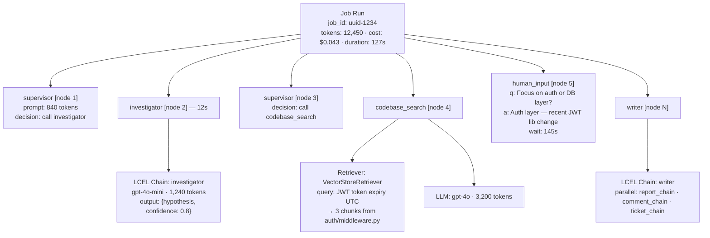

# PRD-005 — Observability & Evaluation: LangSmith

| Field        | Value                                          |
|--------------|------------------------------------------------|
| Document ID  | PRD-005                                        |
| Version      | 1.0                                            |
| Status       | DRAFT                                          |
| Date         | March 2026                                     |
| Parent Doc   | [PRD-001](PRD-001-master-overview.md)          |
| Related Docs | [PRD-003](PRD-003-langgraph-orchestration.md) (Orchestration), [PRD-004](PRD-004-agent-layer.md) (Agent Layer) |

---

## Overview

LangSmith is the observability and evaluation layer of AgentOps Dashboard. It wraps every layer of the stack
automatically — LCEL chains inside each agent, LangGraph orchestration decisions, and full end-to-end job runs — and
surfaces them in a unified tracing dashboard.

Unlike typical application monitoring (Datadog, New Relic), LangSmith is specifically designed for LLM applications. It
understands the concept of tokens, prompts, model calls, tool invocations, and agent reasoning chains — making it the
right tool for this use case.

LangSmith is used in three modes in this product:

1. **Development** — debug why an agent produced a wrong answer by inspecting its exact prompt and model response
2. **Iteration** — run eval datasets after every prompt change to catch regressions before deploying
3. **Production** — monitor live job quality, cost per job, latency per agent, and error rates

---

## Why LangSmith

| Need                                                           | LangSmith Solution                                                                  |
|----------------------------------------------------------------|-------------------------------------------------------------------------------------|
| "Why did the investigator agent produce the wrong hypothesis?" | Full trace: exact prompt sent, token-by-token response, structured output parsed    |
| "Did my prompt change improve agent quality?"                  | Dataset eval: run old vs. new prompt on golden dataset, compare scores side by side |
| "How much does one bug triage job cost?"                       | Automatic token counting and cost calculation per run, per agent, per job           |
| "Which agent is the slowest bottleneck?"                       | Latency breakdown per node in the LangGraph trace                                   |
| "Is agent quality degrading over time?"                        | Production monitoring with trend charts over rolling 7-day window                   |
| "Can I A/B test two different critic prompts?"                 | LangSmith experiments: split traffic or run parallel evals                          |

LangSmith is framework-agnostic — it instruments LCEL chains (via LangChain), LangGraph nodes (natively), and LangServe
endpoints (automatically). Zero extra instrumentation code is required beyond setting the environment variables.

---

## Trace Architecture

### Trace Levels

LangSmith captures traces at three levels, all linked in a parent–child hierarchy:



### What Gets Automatically Captured

No manual instrumentation is needed for:

- All LCEL chain inputs and outputs (LangChain native)
- All LangGraph node transitions, state diffs, and routing decisions (LangGraph native)
- All LangServe endpoint calls — token counts, latency, model used (LangServe native)
- Tool calls (Tavily, Chroma retriever) — query sent, results returned

Manual tagging is added for:

- `job_id` — links LangSmith trace to AgentOps job record
- `repository` — enables filtering by repo in LangSmith dashboard
- `human_question` / `human_answer` — captured as metadata on the `human_input` node

---

## Integration Setup

### Environment Variables

```bash
# Set in all services (orchestration + all LangServe agents)
LANGSMITH_TRACING=true
LANGSMITH_API_KEY=lsv2_...
LANGSMITH_PROJECT=agentops-dashboard   # separates prod traces from dev
LANGSMITH_ENDPOINT=https://api.smith.langchain.com
```

No other code changes are required. LangSmith auto-instruments all LangChain and LangGraph calls when
`LANGSMITH_TRACING=true`.

### Project Separation

| Environment | LangSmith Project  | Purpose                                  |
|-------------|--------------------|------------------------------------------|
| Development | `agentops-dev`     | Local debugging; noisy traces acceptable |
| Staging     | `agentops-staging` | Eval runs against golden dataset         |
| Production  | `agentops-prod`    | Live monitoring; alerts configured here  |

### Tagging Runs

Each LangGraph job run is tagged with metadata for filtering:

```python
config = {
    "configurable": {"thread_id": job_id},
    "metadata": {
        "job_id": job_id,
        "repository": state["repository"],
        "issue_url": state["issue_url"],
        "env": os.getenv("ENVIRONMENT", "dev"),
    },
    "tags": ["bug-triage", state["repository"]]
}
```

---

## Trace Hierarchy

### Accessing the Trace URL

LangSmith returns a `run_id` at the start of each traced execution. This is captured and stored in
`BugTriageState.langsmith_run_id` so the frontend can construct a deep-link:

```python
# FastAPI: capture run ID when starting a job
with tracing_v2_enabled(project_name="agentops-prod") as cb:
    result = await graph.ainvoke(initial_state, config=config)
    run_id = cb.traced_runs[0].id  # top-level run ID
    # Store run_id → job_id mapping in DB
```

Deep-link format:

```text
https://smith.langchain.com/o/{org_id}/projects/p/{project_id}/r/{run_id}
```

---

## UI Integration — LangSmith Deep Links

### "View in LangSmith" Button

Every completed or failed job in the AgentOps Dashboard UI shows a **"View in LangSmith"** button in the Output Panel (
[PRD-002](PRD-002-frontend-ux.md), Zone 3). This button opens the full job trace in a new tab.

The trace shows:

- The complete LangGraph execution tree
- Every agent's exact prompt and response
- Token counts and costs broken down by node
- The human interrupt: question asked, time waited, answer given
- Any errors with full stack traces

### Job-Level Trace Summary (In-App)

A lightweight summary of the LangSmith trace is shown directly in the AgentOps UI (no need to navigate to LangSmith for
basic info):

```text
┌─────────────────────────────────────────────────────────┐
│  JOB TRACE SUMMARY                                       │
│  Total tokens: 12,450    Estimated cost: $0.043          │
│  Total duration: 2m 7s   Nodes executed: 8               │
│  Slowest agent: codebase_search (18s)                    │
│                              [View full trace ↗]         │
└─────────────────────────────────────────────────────────┘
```

This data is fetched from the LangSmith API after job completion and cached in the backend DB.

---

## Evaluation Framework

### What Gets Evaluated

The eval framework measures three things:

| Dimension             | Question                                                             | Evaluator Type                                    |
|-----------------------|----------------------------------------------------------------------|---------------------------------------------------|
| **Triage Accuracy**   | Does the root cause match what a human engineer would identify?      | LLM-as-judge + human comparison                   |
| **Report Usefulness** | Is the final report helpful and actionable?                          | LLM-as-judge (GPT-4o rubric)                      |
| **Question Quality**  | When the supervisor asks the user a question, is it a good question? | Human feedback (thumbs up/down in UI)             |
| **Agent Efficiency**  | Did the supervisor route optimally (no redundant agent calls)?       | Automated: count supervisor hops vs. minimum path |

### LLM-as-Judge Setup

```python
from langsmith.evaluation import evaluate, LangChainStringEvaluator

helpfulness_evaluator = LangChainStringEvaluator(
    "criteria",
    config={
        "criteria": {
            "helpfulness": "Is this triage report specific, actionable, and correct?",
            "completeness": "Does the report cover severity, root cause, relevant files, and a fix suggestion?",
            "accuracy": "Does the root cause match the reference answer?"
        },
        "llm": ChatOpenAI(model="gpt-4o", temperature=0)
    }
)

results = evaluate(
    lambda inputs: run_triage_job(inputs["issue_url"]),
    data="agentops-golden-dataset-v1",
    evaluators=[helpfulness_evaluator],
    experiment_prefix="prompt-change-2026-03",
)
```

### Scoring Rubric

| Score | Meaning                                                                             |
|-------|-------------------------------------------------------------------------------------|
| 5     | Perfect: root cause is correct, files are exact, report is clear and actionable     |
| 4     | Good: root cause is correct, minor gaps in files or report formatting               |
| 3     | Partial: hypothesis is on the right track but root cause is incomplete or imprecise |
| 2     | Poor: wrong code area identified, or report is too vague to be actionable           |
| 1     | Fail: completely wrong diagnosis or empty output                                    |

**Target:** Average score ≥ 4.0 / 5.0 on the golden dataset before any prompt change is deployed to production.

---

## Golden Dataset

### Structure

The golden dataset is a collection of real GitHub issues with human-authored reference answers:

```python
{
    "issue_url": "https://github.com/org/repo/issues/1042",
    "issue_title": "Auth token expiry causes 500 on /api/me",
    "issue_body": "...",
    "reference": {
        "severity": "HIGH",
        "root_cause": "JWT expiry check in auth/middleware.py:L142 uses local time instead of UTC",
        "relevant_files": ["auth/middleware.py", "tests/test_auth.py"],
        "expected_keywords": ["JWT", "UTC", "timezone", "token expiry"]
    }
}
```

### Dataset Growth Plan

| Phase       | Dataset Size | Source                                      |
|-------------|--------------|---------------------------------------------|
| v1.0 launch | 20 issues    | Manually authored from real repos           |
| v1.1        | 50 issues    | User feedback thumbs up/down on job outputs |
| v2.0        | 200+ issues  | Crowdsourced from community contributors    |

### Dataset Management

The golden dataset is managed in LangSmith's Datasets UI. New examples can be added directly from a LangSmith trace: if
a live production job produces a high-quality output, it can be added to the dataset in one click via LangSmith's "Add
to Dataset" feature.

---

## Automated Eval Pipeline

### When Evals Run

| Trigger                                         | Action                                                                          |
|-------------------------------------------------|---------------------------------------------------------------------------------|
| Any agent prompt change proposed in a PR to `main` | CI pipeline runs eval against golden dataset; fails PR if avg score drops > 0.3 |
| New LangServe agent version deployed to staging | Eval runs automatically; results posted to PR as a comment                      |
| Daily at 02:00 UTC                              | Production eval: random sample of 10 recent jobs scored and logged              |
| Manual trigger                                  | Developer can run evals on demand from LangSmith UI or CLI                      |

### CI Integration

```yaml
# .github/workflows/eval.yml
- name: Run LangSmith Evals
  run: |
    python scripts/run_evals.py \
      --dataset agentops-golden-dataset-v1 \
      --project agentops-staging \
      --min-score 4.0 \
      --fail-on-regression
```

---

## Cost and Latency Monitoring

### Per-Job Cost Tracking

LangSmith automatically tracks token usage per run. The backend aggregates this into per-job cost estimates shown in the
AgentOps UI:

| Agent                   | Avg Tokens/Job | Avg Cost/Job |
|-------------------------|----------------|--------------|
| Investigator            | ~1,200         | ~$0.001      |
| Codebase Search         | ~3,500         | ~$0.007      |
| Web Search              | ~2,000         | ~$0.002      |
| Critic                  | ~2,500         | ~$0.005      |
| Writer                  | ~4,000         | ~$0.012      |
| Supervisor (all hops)   | ~2,000         | ~$0.002      |
| **Total (typical job)** | **~15,200**    | **~$0.029**  |

*Estimates based on GPT-4o-mini at $0.15/1M input tokens, GPT-4o at $2.50/1M input tokens.*

### Cost Budget Alerts

Users can set a per-job cost limit in Settings. If a job's running cost (tracked via LangSmith's API) exceeds the limit,
the supervisor is notified and moves toward the `writer` node to wrap up, rather than spawning more agents.

### Latency Dashboard

The Analytics page (v1.1) shows rolling 7-day charts from LangSmith data:

- Average job duration (P50, P95)
- Per-agent latency breakdown
- Human wait time (time between question asked and answer received)
- Jobs per day, error rate per day

---

## Prompt Iteration Workflow

The workflow for safely improving agent quality using LangSmith:

```text
1. OBSERVE
   Identify a failing job in production via LangSmith traces
   Note which agent produced the bad output and why

2. PROTOTYPE
   Open LangFlow canvas for that agent
   Reproduce the failure with the same input
   Iterate on the system prompt until output improves

3. EVALUATE
   Export updated prompt to Python
   Update the agent's LangServe service
   Deploy to staging

4. RUN EVALS
   Trigger eval pipeline: python scripts/run_evals.py
   Check score vs. baseline on golden dataset
   If score improves (or doesn't regress): proceed

5. DEPLOY
   Merge to main
   CI runs eval one more time as gate
   Deploy to production LangServe endpoint

6. MONITOR
   LangSmith production dashboard shows new scores
   Daily eval confirms improvement holds over time
```

---

## Alerting and Anomaly Detection

### Automated Alerts (v1.1)

LangSmith supports rule-based automations that trigger actions when conditions are met:

| Alert               | Condition                               | Action                                 |
|---------------------|-----------------------------------------|----------------------------------------|
| Quality degradation | 7-day rolling avg score drops below 3.5 | Slack notification to engineering team |
| High cost job       | Single job exceeds $0.20                | Flag job in UI; notify via email       |
| Agent error spike   | Error rate > 10% in last hour           | PagerDuty alert                        |
| Slow job            | Job duration > 5 minutes                | Warning badge in UI                    |

### Manual Review Queue

Any job where:

- The final confidence score is < 0.5, OR
- The user gave a thumbs-down on the output, OR
- An agent errored and was skipped

…is automatically added to a **Manual Review Queue** in LangSmith for the team to inspect and potentially add to the
golden dataset.
